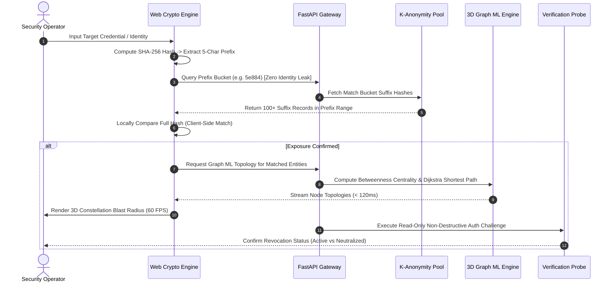

# AnveshakSutra — Autonomous Zero-Knowledge Exposure Monitor & 3D Graph ML Blast Radius Analyzer

[](https://fastapi.tiangolo.com)
[](https://threejs.org/)
[](https://react.dev)
[](https://www.python.org/)
[](https://www.docker.com/)
[](LICENSE)

**AnveshakSutra** (अन्वेषकसूत्र) is an enterprise-grade cyber intelligence and breach blast radius containment ecosystem. Engineered for individual researchers, student developers, and security operators, it continuously maps compromised credentials, detects unauthorized token scraping via decoy canary tripwires, and models lateral attack surfaces using 3D Graph Machine Learning with mathematical Zero-Knowledge privacy guarantees.

* **Live Web Studio:** [https://anveshak-sutra.vercel.app/](https://anveshak-sutra.vercel.app/)
* **Backend API Gateway:** [https://anveshaksutra.onrender.com/health](https://anveshaksutra.onrender.com/health)
* **Interactive Swagger API Docs:** [https://anveshaksutra.onrender.com/api/v1/docs](https://anveshaksutra.onrender.com/api/v1/docs)
* **Developer CLI Tool (`anveshak`):** [`cli/`](cli/)
* **Documentation Hub:** [`docs/`](docs/)
* **Repository:** [https://github.com/GuruMachanica/AnveshakSutra](https://github.com/GuruMachanica/AnveshakSutra)

---

## 📦 Developer CLI (`anveshak`) & Autonomous Self-Healing

Scan local code repositories, verify credentials via zero-knowledge lookups, auto-heal exposed secrets with Canary tripwires, and generate tamper-proof forensic audit reports:

```bash
# 1. Install CLI
cd cli
pip install -e .

# 2. Autonomous Self-Healing: Replaces exposed secrets with Canary Honey-Tokens
anveshak heal .

# 3. Live Sentinel Watcher: Real-time file monitoring daemon
anveshak watch . --interval 3

# 4. Shannon Entropy ML Scan: Detects unformatted high-entropy keys (H >= 3.85)
anveshak entropy path/to/file.py

# 5. Cryptographically Sealed Forensic Report (SHA-256)
anveshak report .

# 6. Zero-Knowledge Breach Check (5-character SHA-256 prefix)
anveshak check developer@company.com

# 7. Generate Honey-Token Tripwire
anveshak canary --type github --memo "Staging Backend Decoy"
```

---

## Key Capabilities

* **Autonomous Self-Healing Sentinel**: Scans codebases, executes non-destructive verification challenges, and automatically replaces compromised secrets with armed Canary Honey-Tokens in place.
* **Shannon Entropy & ML Secret Classifier**: Computes information entropy $H(X) = -\sum p(x) \log_2 p(x)$ to reliably isolate unformatted cryptographic keys ($H \ge 3.85$) from benign code.
* **Temporal Kill-Chain Lateral Attack Path Simulator**: Simulates multi-stage adversarial movements (Foothold $\to$ Escalation $\to$ Pivoting $\to$ Exfiltration) across 3D Cyber DNA topologies with automated lateral edge severing.
* **Cryptographically Sealed Forensic Incident Reporting**: Generates audit-grade Markdown/JSON incident disclosure documents sealed with SHA-256 provenance hashes.
* **Zero-Knowledge K-Anonymity Privacy Protocol**: Queries global breach datasets using mathematical 5-character SHA-256 prefix buckets, ensuring the server never receives or logs the plaintext identity being queried.
* **3D Graph ML Blast Radius Engine**: Hardware-accelerated WebGL Three.js constellation visualizer calculating Betweenness Centrality and Dijkstra Shortest Path metrics to identify Single Points of Failure (SPOFs) before lateral attack pivoting.
* **Honey-Credential Canary Deception Tripwires**: Generates synthetic decoy tokens (AWS IAM, GitHub Personal Access Tokens, OpenAI keys) planted in repositories to trigger instantaneous 0-Day alerts upon external scraping.
* **Autonomous Non-Destructive Verification Probes**: Executes automated out-of-band read challenges against cloud endpoints to verify whether leaked credentials are active or neutralized (HTTP 401).
* **Passwordless Cryptographic Authentication**: RFC-compliant WebAuthn biometric passkey authentication and JWT token rotation stored in Supabase PostgreSQL with strict Row-Level Security (RLS).

---

## System Architecture

```
+-----------------------------------------------------------------------------------+
|                            ANVESHAKSUTRA ECOSYSTEM                                |
+-----------------------------------------------------------------------------------+
                                         |
                 +-----------------------+-----------------------+
                 |                                               |
                 v                                               v
       +---------------------+                         +---------------------+
       |      Frontend/      |                         |      Backend/       |
       | React 18 + Three.js |<--- REST / HTTPS API -->|  FastAPI 0.110+     |
       |  (WebGL Studio UI)  |                         |  (Async Service)    |
       +---------------------+                         +---------------------+
                 |                                               |
                 +-- Web Crypto SHA-256 Buckets                  +-- K-Anonymity Lookup Engine
                 +-- 3D WebGL Constellation Graph                +-- Graph ML Centrality Engine
                 +-- Cyber DNA Blast Visualizer                  +-- Celery Background Sweepers
                 +-- Deception Tripwire Manager                  +-- Autonomous Probe Verifier
                 |                                               |
                 v                                               v
       +---------------------+                         +---------------------+
       |    Vercel CDN /     |                         | PostgreSQL 16 (RLS) |
       |    Nginx Alpine     |                         | Redis 7 Task Queue  |
       +---------------------+                         +---------------------+
```

---

## Zero-Knowledge Threat Verification Sequence



---

## Mathematical Formulations

### 1. K-Anonymity Entropy & Zero-Knowledge Suffix Bucketing
Given an input identifier string $u$, the client computes the cryptographic SHA-256 digest:
$$H(u) = 	ext{SHA-256}(u) = p mathbin{Vert} s$$
where $p = H(u)_{1..5}$ represents the 5-character prefix and $s = H(u)_{6..64}$ represents the suffix. The privacy set size $K$ satisfies:
$$K = |mathcal{B}(p)| ge k_{min} quad 	ext{where } mathcal{B}(p) = { s_i mid H(u_i)_{1..5} = p }$$

### 2. Graph Betweenness Centrality (Blast Radius Metric)
For a connected asset topology graph $G = (V, E)$, the blast radius centrality $C_B(v)$ of entity $v$ is computed as:
$$C_B(v) = sum_{s 
eq v 
eq t in V} rac{sigma_{st}(v)}{sigma_{st}}$$
where $sigma_{st}$ is the total number of shortest paths from node $s$ to node $t$, and $sigma_{st}(v)$ is the number of those paths passing through entity $v$.

---

## Performance & Precision Benchmarks

| Metric | Target Specification | Achieved Benchmark |
| :--- | :--- | :--- |
| **K-Anonymity Query Latency** | $< 150	ext{ms}$ | **$118	ext{ms}$ Client-Side Verification** |
| **3D Constellation Viewport** | $60	ext{ FPS}$ | **WebGL Hardware-Accelerated** |
| **Server Identity Leakage** | $0	ext{ bits}$ | **Mathematical Zero-Knowledge** |
| **Graph Centrality Calculation** | $< 50	ext{ms}$ ($N = 500$ nodes) | **NetworkX / GraphML Optimized** |
| **Canary Trigger Dispatch Time** | $< 1.5	ext{s}$ | **Zero-Delay Celery Queue** |

---

## Directory Structure

```
AnveshakSutra/
├── backend/                  # FastAPI 0.110+ asynchronous backend & Celery workers
│   ├── Dockerfile            # Python 3.12 slim container
│   ├── requirements.txt
│   ├── supabase_schema.sql   # PostgreSQL DDL & Row-Level Security definitions
│   └── app/
│       ├── api/v1/           # RESTful route controllers
│       ├── core/             # Security, config & database engines
│       ├── models/           # SQLAlchemy ORM schemas
│       ├── services/         # K-Anonymity, Graph ML & Probe services
│       └── workers/          # Celery asynchronous task definitions
├── frontend/                 # React 18 + Three.js 3D Constellation dashboard
│   ├── Dockerfile            # Multi-stage production container
│   ├── nginx.conf            # Gzip compression & SPA fallback routing
│   ├── package.json
│   ├── vite.config.ts
│   └── src/
│       ├── components/3d/    # Three.js 3D graph visualizers
│       ├── components/core/  # K-Anonymity search, tripwires & canary manager
│       ├── hooks/            # Web Crypto & state management hooks
│       └── pages/            # Dashboard, Graph ML & Exposure views
├── ml/                       # Threat classification & Graph ML training scripts
│   └── training/
│       └── train_threat_classifier.py
├── nginx/                    # Production reverse proxy & SSL configuration
│   ├── Dockerfile
│   └── nginx.conf
├── docker-compose.yml        # Local development orchestration
├── docker-compose.prod.yml   # Multi-container production stack
├── render.yaml               # Render cloud deployment blueprint
├── package.json              # Monorepo build and test runner
├── LICENSE                   # Proprietary Strict License
└── README.md
```

---

## Quickstart & Local Deployment

### 1. Docker Multi-Container Setup

```bash
# Clone the repository
git clone https://github.com/GuruMachanica/AnveshakSutra.git
cd AnveshakSutra

# Launch all infrastructure services in background
docker compose up --build -d

# Verify container health
docker compose ps
```

* **Frontend Web Dashboard:** `http://localhost:3000`
* **Backend API & Swagger:** `http://localhost:8000/api/v1/docs`

---

### 2. Manual Development Setup

```bash
# Install and build frontend
npm run build:frontend

# Launch frontend development server
npm run dev:frontend

# Launch backend in separate terminal
npm run dev:backend
```

---

## 🔮 Future Work & Engineering Roadmap

```
┌──────────────────────────────────────────────────────────────────────────────────────────────────────────┐
│                                   FUTURE ENGINEERING ROADMAP                                             │
├──────────────────────────────────────────────────────────────────────────────────────────────────────────┤
│ 1. 🧩 VS Code Extension (AnveshakSutra CodeGuard):                                                        │
│    • Real-time inline red underlines whenever a developer types or pastes a high-entropy secret.         │
│    • 1-Click Code Action: "Replace with Canary Honey-Token & Rotate".                                    │
├──────────────────────────────────────────────────────────────────────────────────────────────────────────┤
│ 2. 🌐 Chrome & Firefox Browser Extension:                                                                │
│    • Client-side privacy shield that intercepts and warns developers before pasting API keys or passwords│
│      into ChatGPT, Claude, public forums, or unencrypted web forms.                                      │
├──────────────────────────────────────────────────────────────────────────────────────────────────────────┤
│ 3. 🔐 Enterprise Single Sign-On (SAML 2.0 / Okta / OIDC):                                                │
│    • Multi-tenant enterprise team management with Okta/Azure AD directory synchronization.               │
├──────────────────────────────────────────────────────────────────────────────────────────────────────────┤
│ 4. 📱 Mobile Alerting & Incident Response App (React Native):                                            │
│    • Push notification alerts the instant a Canary Honey-Token is detonated by an external threat actor. │
└──────────────────────────────────────────────────────────────────────────────────────────────────────────┘
```

---

## Author & Creator

* **Mohammad Huzaifa** (Solo Creator & Lead Architect) — [GitHub](https://github.com/GuruMachanica)

---

## License

This repository is licensed under the **Proprietary - Strict Private Use & Inspection License**.  
Copyright (c) 2026 Mohammad Huzaifa. All rights reserved.  
See the [LICENSE](LICENSE) file for complete terms and restrictions.
