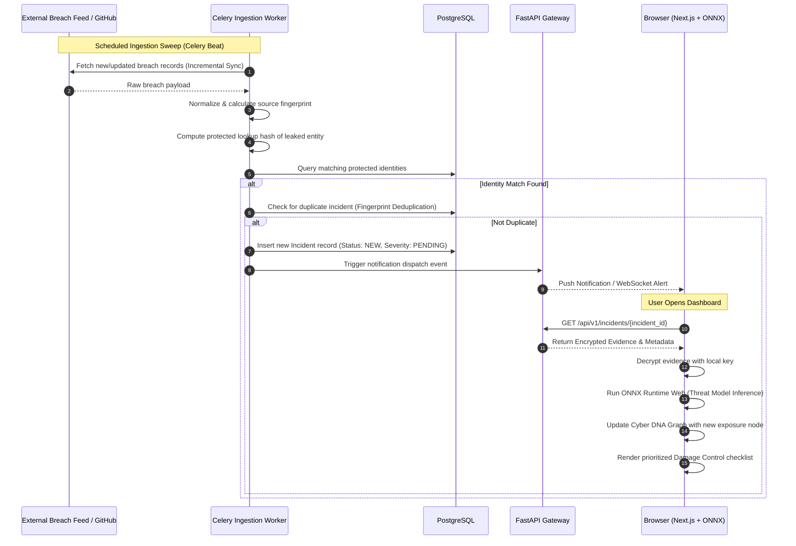

# AnveshakSutra — 01. System Architecture & Topology

---

## 1. End-to-End System Topology

AnveshakSutra is architected as a distributed, browser-first system with strict separation between client-side intelligence/cryptography and backend indexing/automation workers.

```
                               ┌─────────────────────────────────────────────────────────┐
                               │                    USER BROWSER / PWA                   │
                               │                                                         │
                               │  ┌─────────────────────────┐   ┌─────────────────────┐  │
                               │  │   Next.js 14 App Router │   │ Cyber DNA Visualizer│  │
                               │  │   (TypeScript / Tailwind│   │ (Graph Canvas/SVG)  │  │
                               │  └────────────┬────────────┘   └──────────▲──────────┘  │
                               │               │                           │             │
                               │  ┌────────────┴────────────┐   ┌──────────┴──────────┐  │
                               │  │ Web Crypto Client       │   │ ONNX Runtime Web    │  │
                               │  │ • Argon2id KDF          │   │ • WebGPU / WASM     │  │
                               │  │ • AES-256-GCM           │   │ • Threat Classifier │  │
                               │  │ • Protected Blind Hashes│   │ • Attack Predictor  │  │
                               │  └────────────┬────────────┘   └──────────▲──────────┘  │
                               │               │                           │             │
                               │  ┌────────────┴────────────┐              │             │
                               │  │ Local IndexedDB Storage │──────────────┘             │
                               │  │ (Encrypted Vault Cache) │                            │
                               │  └────────────┬────────────┘                            │
                               └───────────────┼─────────────────────────────────────────┘
                                               │ HTTPS / TLS 1.3
                                               ▼
      ═════════════════════════════════════════════════════════════════════════════════════════
                                   BACKEND APPLICATION & WORKERS
      ═════════════════════════════════════════════════════════════════════════════════════════
                                               │
                               ┌───────────────▼────────────────┐
                               │  FastAPI REST API Gateway       │
                               │  ├── Auth / Passkeys (WebAuthn)│
                               │  ├── Identity Protected Lookup │
                               │  ├── Incident Management       │
                               │  ├── Damage Control Coordinator│
                               │  └── Audit Logging             │
                               └───────┬────────────────┬───────┘
                                       │                │
                        ┌──────────────┘                └──────────────┐
                        ▼                                              ▼
             ┌─────────────────────┐                        ┌─────────────────────┐
             │ PostgreSQL 16+ DB   │                        │ Redis 7+ Broker     │
             │ • Identities (Blind)│                        │ • Task Queue        │
             │ • Normalized Leaks  │                        │ • Cache & Dedupe    │
             │ • Incident Records  │                        │ • Rate Limiting     │
             │ • Audit Log Trail   │                        └──────────┬──────────┘
             └─────────────────────┘                                   │
                                                                       ▼
                                                            ┌─────────────────────┐
                                                            │ Celery Worker Node  │
                                                            │ & Celery Beat       │
                                                            └──────────┬──────────┘
                                                                       │
                                      ┌────────────────────────────────┼────────────────────────────────┐
                                      ▼                                ▼                                ▼
                        ┌───────────────────────────┐    ┌───────────────────────────┐    ┌───────────────────────────┐
                        │ Breach Feeds & Dumps      │    │ Threat Intel & OSINT      │    │ GitHub & Secret Scanners  │
                        │ (Normalized Connectors)   │    │ (Public Leak Indexes)     │    │ (Public Repos / Commits)  │
                        └───────────────────────────┘    └───────────────────────────┘    └───────────────────────────┘
```

---

## 2. Component Breakdown & Responsibilities

| Component | Layer | Core Tech | Primary Responsibility |
| :--- | :--- | :--- | :--- |
| **Frontend Client** | Browser / PWA | Next.js, React, Tailwind | UI rendering, user dashboard, Cyber DNA graph explorer, damage control checklist |
| **Client Crypto Engine** | Browser | Web Crypto API, `@noble/hashes` | Encrypting user identities, deriving blinded search tokens (`Argon2id` + `AES-256-GCM`) |
| **On-Device AI Engine** | Browser | ONNX Runtime Web | Running local ML inference for incident severity, attack paths, and risk explanations |
| **Client Cache** | Browser | IndexedDB (`idb`) | Storing encrypted identities, local settings, and cached ONNX model weights |
| **API Gateway** | Server | FastAPI (Async Python) | Handling authenticated requests, protected queries, incident updates, and notifications |
| **Database** | Server | PostgreSQL 16 | Relational storage for user accounts, encrypted identities, incidents, and audit trails |
| **Message Broker** | Server | Redis 7 | Celery task distribution, alert throttling, and real-time status updates |
| **Worker Cluster** | Server | Celery + Celery Beat | Executing continuous source polling, normalization, deduplication, and verification probes |
| **Connector Pipeline** | Server | Async Python HTTP | Ingesting external feeds (breaches, OSINT, GitHub commits) through unified interfaces |

---

## 3. End-to-End Operational Lifecycle

The AnveshakSutra system lifecycle encompasses 10 distinct phases:

```
 1. REGISTER  ──►  2. PROTECT  ──►  3. MONITOR  ──►  4. DETECT  ──►  5. CORRELATE
 (User Adds       (Client-side      (Continuous      (Match Found    (Cyber DNA Graph
  Identity)        Encryption)       Workers)         in Ingestion)   Relationship)
                                                                           │
                                                                           ▼
10. CLOSE     ◄──  9. VERIFY   ◄──  8. RECOVER  ◄──  7. ALERT   ◄──  6. ASSESS
(Incident Is       (Automated/       (Containment     (Prioritized    (On-Device AI
 Resolved)          Manual Check)     Playbook)        Push & Email)   Local Model)
```

---

## 4. Trust Boundaries & Security Zones

```
┌────────────────────────────────────────────────────────────────────────┐
│ ZONE 1: USER TRUST DOMAIN (Client Device)                              │
│ • Plaintext Identities (Only in client memory during session)          │
│ • Master Cryptographic Keys (Derived from user master key)             │
│ • ONNX Local Inference Execution                                       │
│ • Decrypted Cyber DNA Graph Render                                     │
└───────────────────────────────────┬────────────────────────────────────┘
                                    │
                         BLINDED IDENTIFIERS ONLY
                          (No Plaintext Crosses)
                                    │
                                    ▼
┌────────────────────────────────────────────────────────────────────────┐
│ ZONE 2: PLATFORM BACKEND (FastAPI + PostgreSQL + Celery)               │
│ • Blinded / Protected Lookup Hashes                                    │
│ • Encrypted Identity Blobs (Server cannot decrypt)                     │
│ • Normalized Public Breach Metadata                                    │
│ • Pseudonymized Incident State & Verification Timers                   │
└───────────────────────────────────┬────────────────────────────────────┘
                                    │
                       AUTHENTICATED / RATE-LIMITED
                                    │
                                    ▼
┌────────────────────────────────────────────────────────────────────────┐
│ ZONE 3: EXTERNAL THREAT SOURCES                                        │
│ • Public Breach Databases                                              │
│ • OSINT Threat Feeds                                                   │
│ • GitHub Public API (Secret Discovery)                                 │
└────────────────────────────────────────────────────────────────────────┘
```

---

## 5. Sequence Diagram: End-to-End Ingestion & Incident Generation



---

## 6. Deployment & Infrastructure Architecture

- **Containerization:** All services (`frontend`, `backend`, `celery_worker`, `celery_beat`, `postgres`, `redis`) run as standalone Docker containers via `docker-compose.yml`.
- **Stateless API:** The FastAPI backend is completely stateless, enabling horizontal scaling behind an Nginx or Traefik reverse proxy.
- **Worker Scaling:** Celery worker pools can be scaled dynamically based on Redis queue depth during heavy breach ingestion windows.
