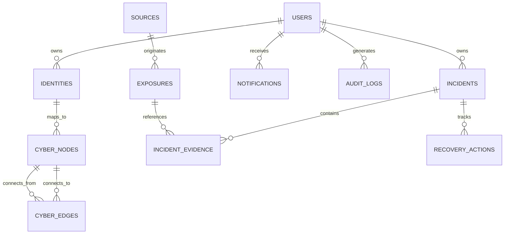

# AnveshakSutra — 07. Database Schema & Data Models

---

## 1. Schema Overview & Principles

The database is built on **PostgreSQL 16+** with strict foreign keys, check constraints, JSONB attributes for graph metadata, and btree/hash indexes for sub-millisecond lookups.

### Security Classification:
- **PUBLIC:** Open metadata, source URLs, timestamps.
- **SENSITIVE (Encrypted):** Identifiers stored as AES-256-GCM ciphertexts (`encrypted_blob`).
- **PROTECTED:** Blinded SHA-256 / HMAC search tokens (`blinded_hash`).
- **NO PLAINTEXT PASSWORDS OR RAW SECRETS ARE STORED SERVER-SIDE.**

---

## 2. Entity Relationship Diagram (ERD)



---

## 3. PostgreSQL DDL Specification

```sql
-- Enable UUID extension
CREATE EXTENSION IF NOT EXISTS "uuid-ossp";

-- 1. USERS TABLE
CREATE TABLE users (
    id UUID PRIMARY KEY DEFAULT uuid_generate_v4(),
    username VARCHAR(64) UNIQUE NOT NULL,
    email_hash VARCHAR(64) UNIQUE NOT NULL,       -- SHA-256 for account uniqueness
    encrypted_email TEXT NOT NULL,                -- AES-256-GCM encrypted
    passkey_credential_id TEXT UNIQUE,            -- WebAuthn credential ID
    passkey_public_key TEXT,                      -- WebAuthn public key (PEM/JWK)
    passkey_sign_count INT DEFAULT 0,
    password_hash VARCHAR(255),                   -- Argon2id hash (if password fallback enabled)
    created_at TIMESTAMPTZ DEFAULT NOW() NOT NULL,
    updated_at TIMESTAMPTZ DEFAULT NOW() NOT NULL
);

-- 2. IDENTITIES TABLE (Zero-Knowledge Protected Identifiers)
CREATE TABLE identities (
    id UUID PRIMARY KEY DEFAULT uuid_generate_v4(),
    user_id UUID NOT NULL REFERENCES users(id) ON DELETE CASCADE,
    identity_type VARCHAR(32) NOT NULL,           -- 'EMAIL', 'USERNAME', 'DOMAIN', 'GITHUB'
    blinded_hash VARCHAR(64) NOT NULL,            -- Salted SHA-256 for O(1) matching
    encrypted_identifier TEXT NOT NULL,           -- AES-256-GCM blob
    status VARCHAR(32) DEFAULT 'ACTIVE' NOT NULL, -- 'ACTIVE', 'PAUSED', 'VERIFICATION_REQUIRED', 'REMOVED'
    verified_at TIMESTAMPTZ,
    created_at TIMESTAMPTZ DEFAULT NOW() NOT NULL,
    updated_at TIMESTAMPTZ DEFAULT NOW() NOT NULL
);
CREATE INDEX idx_identities_blinded_hash ON identities(blinded_hash);
CREATE INDEX idx_identities_user_id ON identities(user_id);

-- 3. SOURCES TABLE (Threat Intelligence Connectors)
CREATE TABLE sources (
    id VARCHAR(64) PRIMARY KEY,                   -- e.g., 'breach_dump_v1', 'github_scanner'
    name VARCHAR(128) NOT NULL,
    source_type VARCHAR(32) NOT NULL,             -- 'BREACH_ARCHIVE', 'OSINT_FEED', 'GITHUB_API'
    reliability_tier VARCHAR(32) NOT NULL,        -- 'OFFICIAL_DISCLOSURE', 'ESTABLISHED_FEED', 'UNVERIFIED'
    last_sync_at TIMESTAMPTZ,
    last_sync_cursor TEXT,
    is_active BOOLEAN DEFAULT TRUE NOT NULL,
    created_at TIMESTAMPTZ DEFAULT NOW() NOT NULL
);

-- 4. EXPOSURES TABLE (Normalized Ingested Records)
CREATE TABLE exposures (
    id UUID PRIMARY KEY DEFAULT uuid_generate_v4(),
    source_id VARCHAR(64) NOT NULL REFERENCES sources(id),
    source_reference VARCHAR(255) NOT NULL,       -- External ID or URL
    affected_service VARCHAR(128) NOT NULL,       -- e.g., 'Adobe', 'Canva', 'GitHub'
    exposure_category VARCHAR(64) NOT NULL,       -- 'CREDENTIAL', 'API_KEY', 'PERSONAL_DATA'
    blinded_entity_hash VARCHAR(64) NOT NULL,     -- Matches identities.blinded_hash
    evidence_metadata JSONB NOT NULL DEFAULT '{}',
    published_at TIMESTAMPTZ,
    discovered_at TIMESTAMPTZ DEFAULT NOW() NOT NULL
);
CREATE INDEX idx_exposures_entity_hash ON exposures(blinded_entity_hash);
CREATE INDEX idx_exposures_service ON exposures(affected_service);

-- 5. INCIDENTS TABLE
CREATE TABLE incidents (
    id UUID PRIMARY KEY DEFAULT uuid_generate_v4(),
    user_id UUID NOT NULL REFERENCES users(id) ON DELETE CASCADE,
    identity_id UUID NOT NULL REFERENCES identities(id) ON DELETE CASCADE,
    composite_fingerprint VARCHAR(64) NOT NULL,   -- Deduplication hash
    severity VARCHAR(32) DEFAULT 'PENDING' NOT NULL, -- 'LOW', 'MEDIUM', 'HIGH', 'CRITICAL'
    status VARCHAR(32) DEFAULT 'NEW' NOT NULL,    -- 'NEW', 'TRIAGED', 'ACTION_REQUIRED', 'IN_PROGRESS', 'AWAITING_VERIFICATION', 'RESOLVED', 'CLOSED'
    encrypted_summary TEXT NOT NULL,              -- AES-256-GCM encrypted summary
    ai_risk_score FLOAT DEFAULT 0.0,
    created_at TIMESTAMPTZ DEFAULT NOW() NOT NULL,
    updated_at TIMESTAMPTZ DEFAULT NOW() NOT NULL,
    closed_at TIMESTAMPTZ
);
CREATE UNIQUE INDEX idx_incidents_dedupe ON incidents(user_id, composite_fingerprint);
CREATE INDEX idx_incidents_user_status ON incidents(user_id, status);

-- 6. INCIDENT EVIDENCE (Mapping Multi-Source Evidence to Incidents)
CREATE TABLE incident_evidence (
    id UUID PRIMARY KEY DEFAULT uuid_generate_v4(),
    incident_id UUID NOT NULL REFERENCES incidents(id) ON DELETE CASCADE,
    exposure_id UUID NOT NULL REFERENCES exposures(id) ON DELETE CASCADE,
    added_at TIMESTAMPTZ DEFAULT NOW() NOT NULL
);

-- 7. CYBER DNA NODES & EDGES (Graph State)
CREATE TABLE cyber_nodes (
    id UUID PRIMARY KEY DEFAULT uuid_generate_v4(),
    user_id UUID NOT NULL REFERENCES users(id) ON DELETE CASCADE,
    node_type VARCHAR(32) NOT NULL,               -- 'IDENTITY', 'SERVICE', 'TOKEN', 'DOMAIN', 'REPO'
    encrypted_label TEXT NOT NULL,                -- Encrypted label
    status VARCHAR(32) DEFAULT 'CLEAN' NOT NULL,  -- 'CLEAN', 'EXPOSED', 'COMPROMISED'
    created_at TIMESTAMPTZ DEFAULT NOW() NOT NULL
);

CREATE TABLE cyber_edges (
    id UUID PRIMARY KEY DEFAULT uuid_generate_v4(),
    user_id UUID NOT NULL REFERENCES users(id) ON DELETE CASCADE,
    source_node_id UUID NOT NULL REFERENCES cyber_nodes(id) ON DELETE CASCADE,
    target_node_id UUID NOT NULL REFERENCES cyber_nodes(id) ON DELETE CASCADE,
    relationship_type VARCHAR(32) NOT NULL,       -- 'OWNS', 'USES', 'DEPENDS_ON', 'EXPOSED_IN'
    created_at TIMESTAMPTZ DEFAULT NOW() NOT NULL
);

-- 8. RECOVERY ACTIONS TABLE
CREATE TABLE recovery_actions (
    id UUID PRIMARY KEY DEFAULT uuid_generate_v4(),
    incident_id UUID NOT NULL REFERENCES incidents(id) ON DELETE CASCADE,
    action_type VARCHAR(64) NOT NULL,             -- 'REVOKE_TOKEN', 'ROTATE_PASSWORD', 'ENABLE_MFA'
    description TEXT NOT NULL,
    priority INT DEFAULT 1 NOT NULL,
    is_completed BOOLEAN DEFAULT FALSE NOT NULL,
    verification_probe_type VARCHAR(64),          -- 'GITHUB_PAT', 'OPENAI_API', 'NONE'
    verification_status VARCHAR(32) DEFAULT 'UNVERIFIED', -- 'UNVERIFIED', 'PROBING', 'VERIFIED', 'FAILED'
    completed_at TIMESTAMPTZ
);

-- 9. AUDIT LOGS TABLE (Append-Only)
CREATE TABLE audit_logs (
    id UUID PRIMARY KEY DEFAULT uuid_generate_v4(),
    user_id UUID REFERENCES users(id) ON DELETE SET NULL,
    event_type VARCHAR(64) NOT NULL,              -- 'USER_LOGIN', 'IDENTITY_ADDED', 'INCIDENT_CLOSED'
    ip_address_hash VARCHAR(64),                  -- Anonymized IP hash
    user_agent VARCHAR(255),
    event_metadata JSONB DEFAULT '{}' NOT NULL,
    created_at TIMESTAMPTZ DEFAULT NOW() NOT NULL
);
CREATE INDEX idx_audit_user_event ON audit_logs(user_id, event_type);
```
